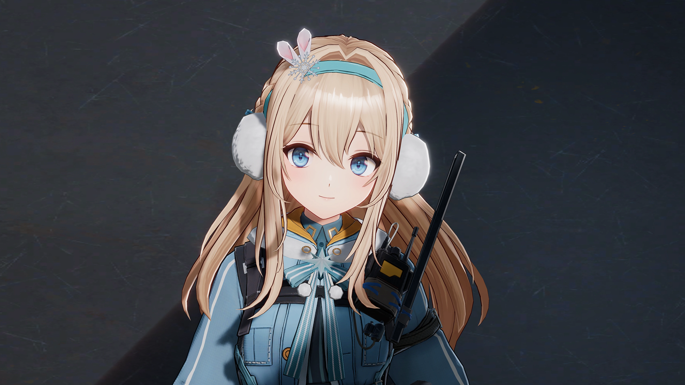
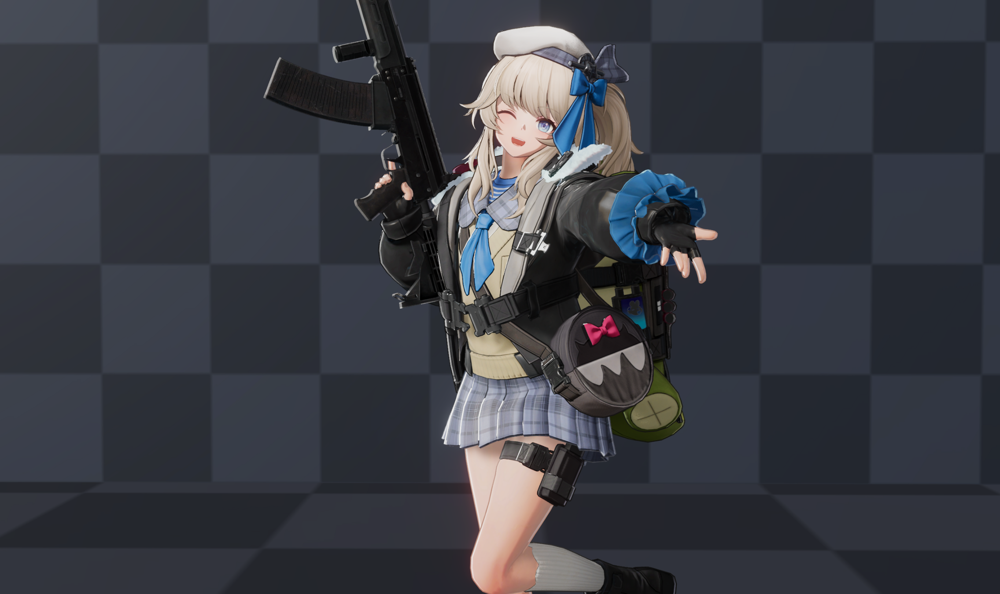
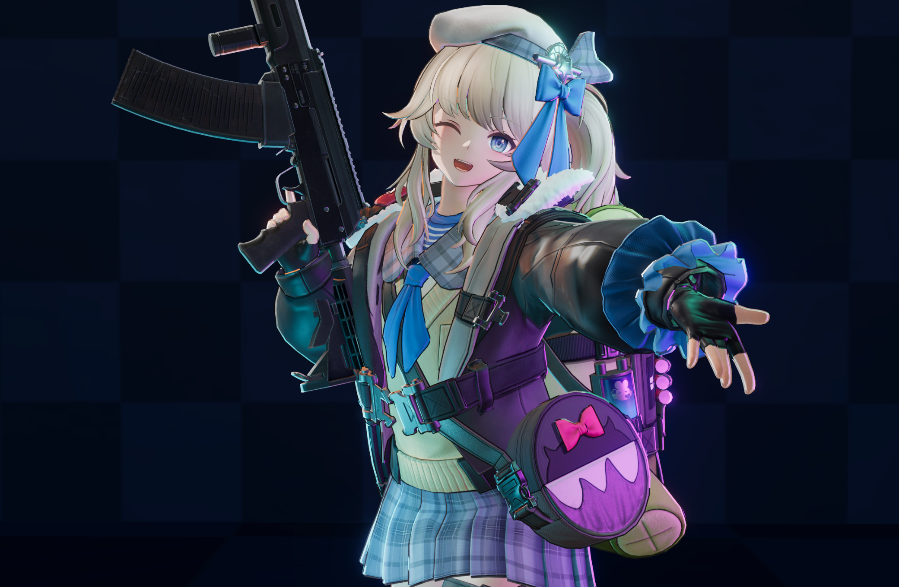
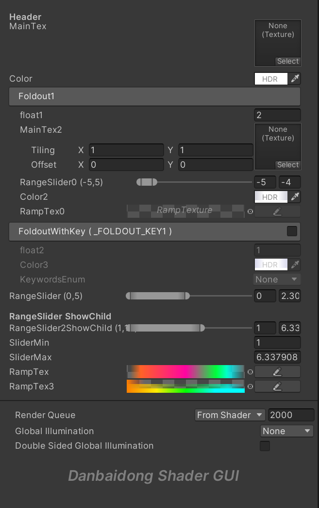
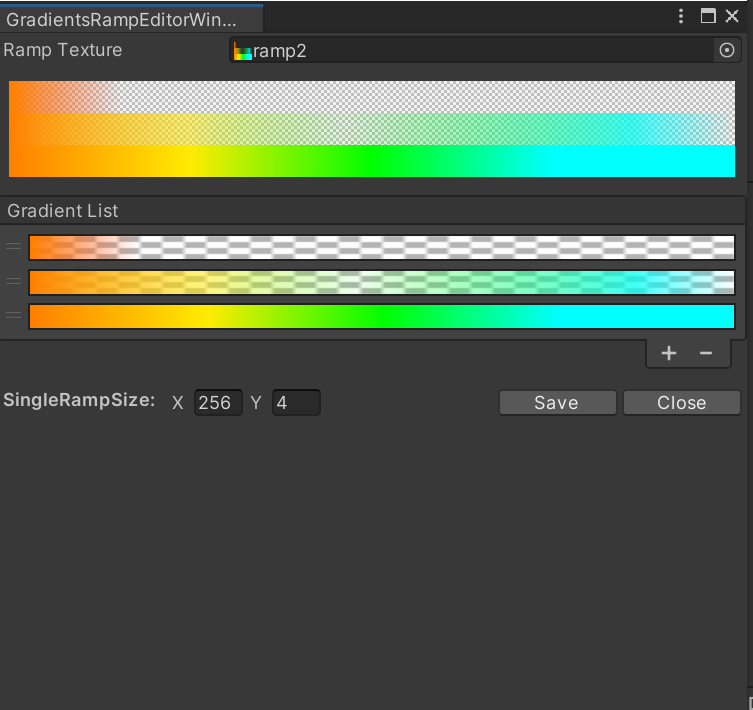
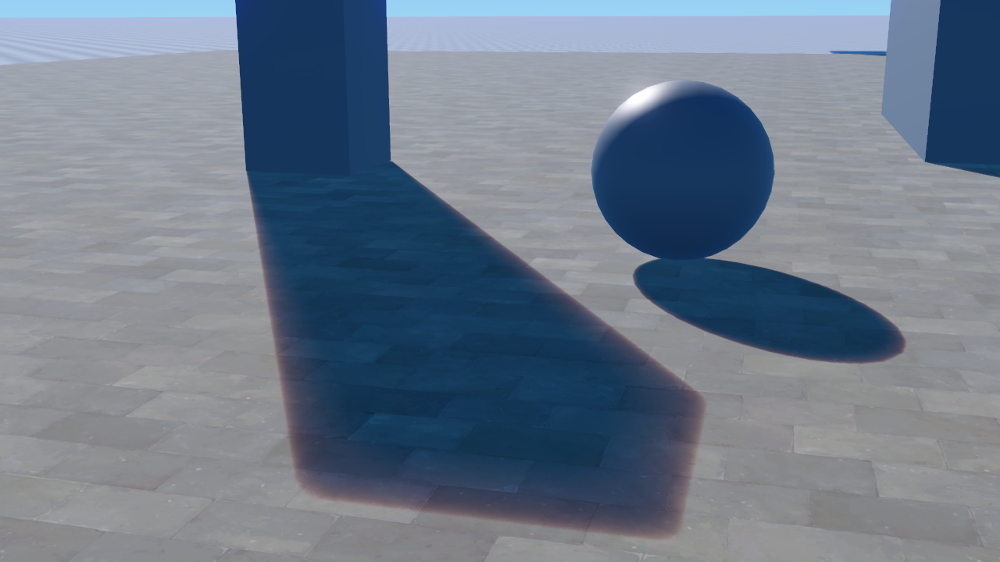
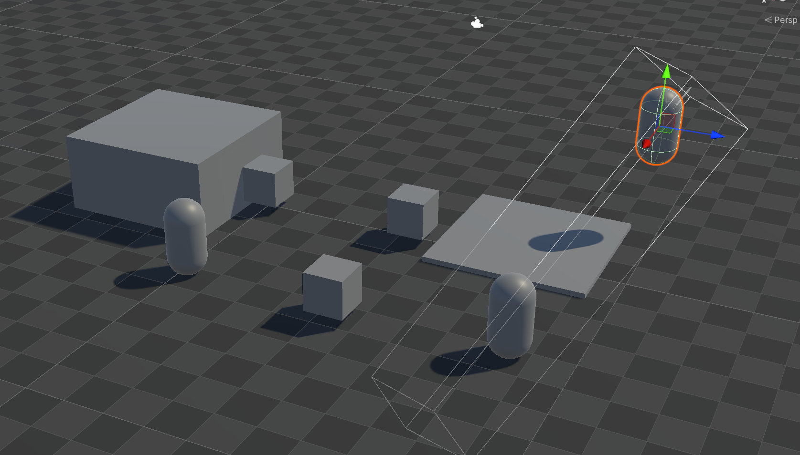
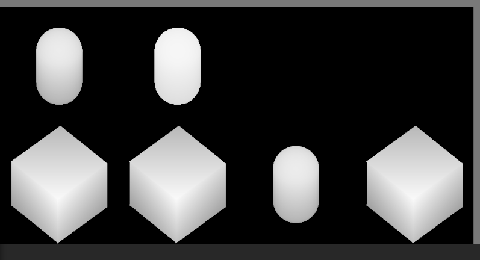
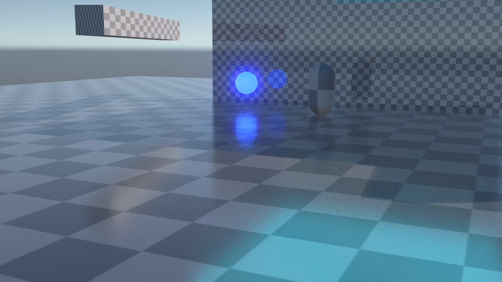
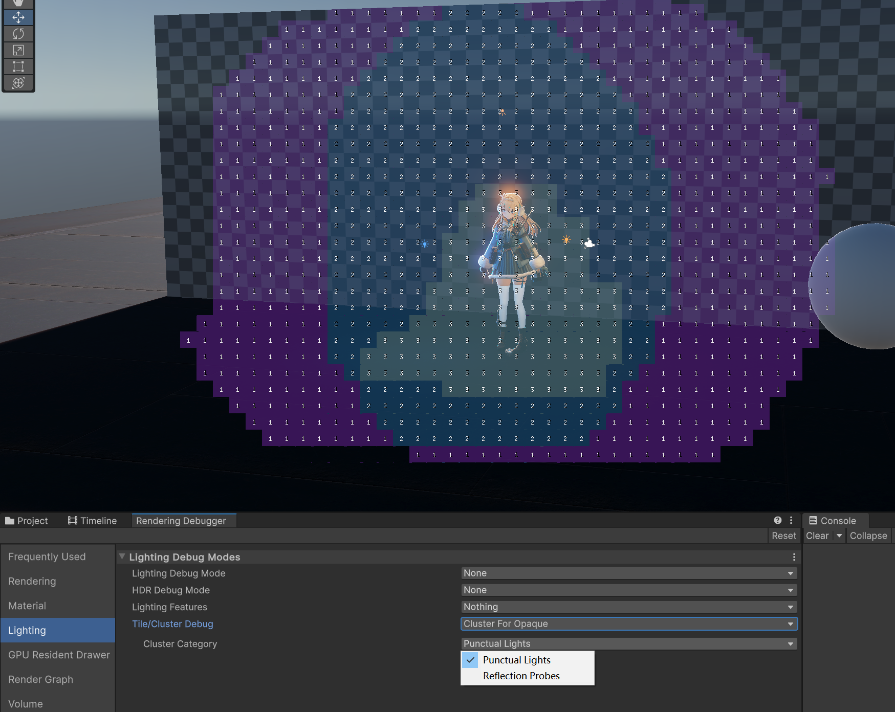

# **Danbaidong Render Pipeline**

## Announcement

Just add something I need.

`DanbaidongRP` is a custom render pipeline built based on `Universal RP 17.0.3`, `Unity 6 (6000.0.30f1)`. This pipeline is optimized for both PBR and NPR Toon Rendering, offering enhanced flexibility for various rendering needs. Future updates will include additional features tailored to my specific requirements.

Subscribe:

* https://space.bilibili.com/39694821
* https://www.zhihu.com/people/danbaidong1111

Roadmap & Features:

- [x] PBR Toon Shader
- [ ] Cel shading
- [x] Danbaidong Shader GUI
- [x] PerObjectShadow
- [x] PCSS/PCF Soft Shadows
- [x] Shadow Scattering
- [ ] Ray Tracing Shadow
- [ ] Transparent Shadows
- [x] Toon Toonmapping
- [x] Toon Bloom
- [x] Visual Sky
- [x] High Quality SSR (Ray Tracing)
- [ ] High Quality SSAO
- [ ] High Quality SSGI
- [x] Cluster Deferred lighting
- [x] Character Forward lighting
- [ ] Atmosphere Fog
- [ ] Idol Live アイドル!!!!!

# Usage

* Create a new Unity 6 URP project (6000.0.30f1).
* *Window -> Package Manager*, remove *Universal RP* and delete the contents of the *Assets/Settings* folder.
* Add *DanbaidongRP* through the *Package Manager*. It is recommended to use the "Install package from disk..." option to individually add the [Core](https://github.com/danbaidong1111/DanbaidongRPCore), [Config](https://github.com/danbaidong1111/DanbaidongRPConfig), and [DanbaidongRP](https://github.com/danbaidong1111/DanbaidongRP) packages (select the `package.json` file for each).
* In the *Settings* directory, recreate the DanbaidongRP Asset by right-clicking and selecting *Create -> Rendering -> Danbaidong RP Asset and Renderer*. Then, in *Edit -> Project Settings -> Graphics*, set the *Default Renderer Pipeline* to the pipeline Asset you just created. The scene should now render correctly.
* Next, restart the project. A Wizard window will pop up, which contains the necessary configurations for the pipeline to use correctly.

# Documents

[DanbaidongRP Documents](https://miusjun13qu.feishu.cn/docx/EXPtdrNmnox8hkx4mnCcy8QNn2b?from=from_copylink) (CN)

# Character Rendering

# Danbaidong Shader GUI

CustomEditor "UnityEditor.DanbaidongGUI.DanbaidongGUI"`

# Shadows

**Shadow Scattering**

**Per Object Shadow**

# Reflections (RayTracing)

# GPU Lights (Cluster)

# Others
 
<table><tr><td valign="top" width="50%">

  
  **Sponsor me**
  

 

 
If you find this project useful or would like to support my ongoing development and maintenance efforts,i would greatly appreciate your sponsorship! Your contributions directly help us improve and sustain the project. 

* 🔧 Developing new features 
* 🛠️ Enhancing and fixing existing functionality
* 📚 Documenting and maintaining resources 
* 🚀 Boosting performance and stability

 

</td><td valign="top" width="50%">

  
  **How to Sponsor**
  

 
  

 

 
</td></tr></table>  
